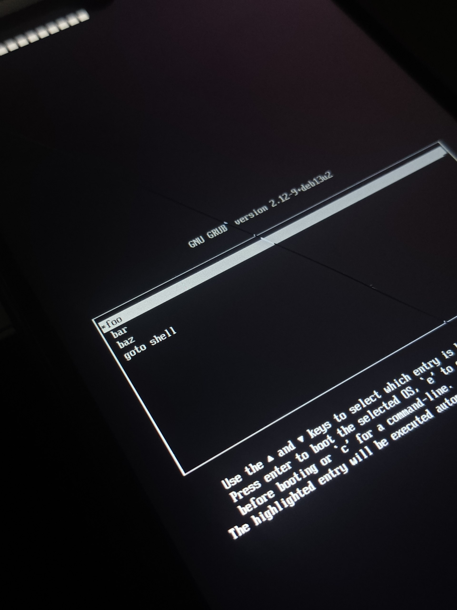
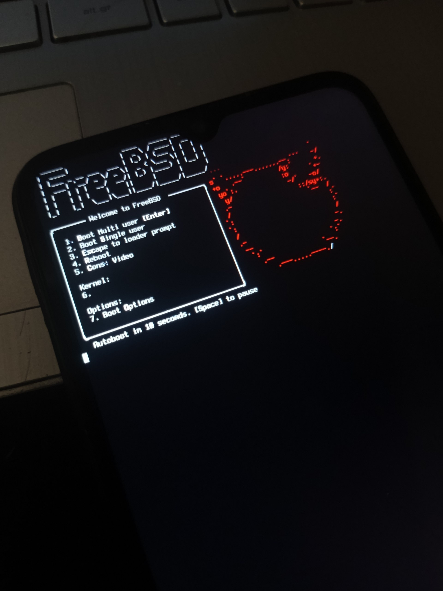

  

<h2 align="center">angelefi-angelican-edk2-mt6765</h2>

Terribly broken, but working EDK2 UEFI firmware for Redmi 9C NFC (MediaTek Helio G35, mt6765)

> [!IMPORTANT]
> The source code of this project is currently **closed** and not publicly available.

> [!WARNING]
> I am **NOT** responsible for **any** damage to your device, including but **NOT** limited to bricking, hardware failure, software malfunction, data loss, security issues, loss of warranty, or **any** other negative consequences that _may_ occur. **You are solely responsible** for any actions you take and any modifications you apply.
>
> Proceed **only** if you fully understand what you are doing and accept all associated risks. If not, please leave this page!

## Status

### Core UEFI Components
- [x] **Proof of Concept (PoC)**
- [x] **Shim akaде Trampoline**
- [x] **FBSL / SimpleFbDxe** (Display output)
- [x] **GRUB / UEFI Shell / FreeBSD loader startup**
  - [x] **Ramdisk** (maps on `FS0:`)
  - [ ] **Linux / FreeBSD boot** (not checked yet)
- [ ] **SD Card / eMMC Storage**
- [ ] **USB (OTG / Host Mode)**
- [x] **KeypadDxe** (Vol+ = Up, Vol- = Down, Vol+ & Vol- = Enter)
- [ ] **Touchscreen / Input**

### WoA
- [ ] **ACPI Tables** (Basic tables for Windows boot)
- [ ] **Windows Boot Manager (`bootmgfw.efi`) startup**
- [ ] **Windows Kernel Boot (OS loading)**
- [ ] **Graphics/Display Driver**

---

## Gallery

---

## Guides & Downloads

*To be added.*

---

## Credits & Acknowledgements

* **[Renegade Project](https://renegade-project.tech/en/home)** — The inspiration for this project.
* **[EDK II](https://github.com/tianocore/edk2)** — This project is based on EDK II. EDK II is developed by the TianoCore Project and is licensed under the BSD 2-Clause Patent License.

> [!NOTE]
> This project is **NOT** based on the Renegade Project and does **NOT** use any of its code, files, or components. Renegade Project is referenced solely as the original source of inspiration.

